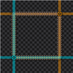

# Cursor Alignment



One-tile-wide translucent alignment guides for **Factorio 2.1**. Align belts, buildings and selections using the live cursor or persistent colored references. **Space Age is not required.**

## Quick start

1. Put `cursor-alignment_<version>.zip` in your Factorio `mods` folder, without extracting it.
2. Enable Cursor Alignment and restart Factorio.
3. Pick up a building or use a copy/selection tool to see the guides.
4. Open the settings panel with Control + Shift + O (Command + Shift + O on macOS).

| Action | Primary default | macOS alternative |
| --- | --- | --- |
| Open settings | Control + Shift + O | Command + Shift + O |
| Toggle visibility | Control + Shift + H | Command + Shift + H |
| Equip alignment tool | Control + Shift + S | Command + Shift + S |

**All shortcuts are customizable** in **Settings → Controls**. Search for Cursor Alignment or the localized action names. The panel displays your actual bindings. Existing user bindings are preserved on upgrades; assign the new alternative manually if it is absent. Command is a supported Factorio modifier, but these alternatives have not been physically tested on a Mac.

## Persistent references

Click the alignment button in the shortcut bar or press Control + Shift + S to equip the alignment tool. Click tiles to add references; click **a marked root tile** again to remove its reference. The tool stays in your hand across repeated clicks. Exit with **Q** (the remappable clear-cursor control), **Escape** or **right click**. Exiting does not delete references. If the button is hidden, enable it in the shortcut bar's selection menu.

Each reference gets its own color and a marked root tile with a contrasting border and center dot. Dragging a selection adds two references at its opposite corner tiles, defining the bounding rectangle. Existing corner references are preserved; a single-tile selection toggles one reference.

Multiple references coexist with live guides. They are saved per player and surface, survive tool changes and save/load, and reappear when you return to their surface. Visibility toggles hide them temporarily; resetting appearance preserves them. References cannot survive deletion of their surface.

## Settings

Use **Clear all references** in the settings panel (Control + Shift + O) to remove all your fixed references across every surface at once. Live guides, appearance settings and other players' references are preserved.

- **Visibility:** enable guides, choose one mode, set reach and filter unsnapped guides.
- **Live guide color:** RGB channels; fixed references keep their automatic colors.
- **Transparency:** color alpha, fill intensity and additive mixing. Hover for explanations.
- **Shortcuts:** one action per row, with your current bindings and removal instructions.

Contextual, manual-toggle and always-visible modes are mutually exclusive radio options. Settings apply immediately and are saved per player. Standard per-player mod settings are also available.

Default band opacity is approximately 16%; overlapping bands can appear stronger. Additive mixing retains more background brightness. Root markers remain prominent to make references easy to remove. These are visual aids: they do not change placement or create world entities.

## Compatibility and limitations

- Requires Factorio 2.1. Optional expansions are not required.
- Uses Factorio APIs shared by Windows, macOS and Linux. Game integration and GUI screenshots have been tested on **Windows with Factorio 2.1.20**. Native Mac/Linux gameplay and real multiplayer have not been verified.
- Ordinary buildings follow the snapped build cursor, with a half-tile correction for even-sized buildings.
- Blueprints, copy/selection tools, tile painting and off-grid/diagonal placement use the free cursor. **Continuous grid snapping for these tools is not implemented.** Fixed references are snapped but stationary.
- **Hold-Shift activation is not implemented.** The public API exposes key activation, not a held-key/release interface. Manual mode is a toggle.
- Empty-hand hover does not activate references automatically. Use the shortcut.
- Guides target the current world surface, not the strategic map.

References: [render targets](https://lua-api.factorio.com/latest/concepts/ScriptRenderTargetTable.html) and [custom inputs](https://lua-api.factorio.com/latest/prototypes/CustomInputPrototype.html).

## Default installation paths

| Platform | Mods folder |
| --- | --- |
| Windows | `%APPDATA%\Factorio\mods` |
| macOS | `~/Library/Application Support/factorio/mods` |
| Linux | `~/.factorio/mods` |

Portable installations, Flatpak and custom configurations can use different locations. See [Factorio's application directory documentation](https://wiki.factorio.com/User_data_directory). Avoid installing both an extracted source folder and a ZIP of this mod.

## Build from source

Requires **Python 3.9+**, with no third-party modules. Python and Make are development tools, not dependencies for playing with the mod.

```sh
python3 tools/build.py check
python3 tools/build.py build
```

On Windows, use `python`, `py -3`, or the compatibility wrapper:

```powershell
py -3 tools/build.py build
.\build.ps1 test
```

GNU Make is optional. Targets include `build`, `check`, `test`, `test-build`, `test-client`, `install`, `clean`, `rebuild`, and `doctor`. Use `make PYTHON=python3 build` to choose the interpreter.

See [DEVELOPMENT.md](DEVELOPMENT.md) for testing, path overrides, packaging and installation safety. See [PUBLISHING.md](PUBLISHING.md) for the release checklist and portal upload instructions.

## Languages and feedback

English, Brazilian Portuguese, Spanish, French, German, Italian, Russian, Simplified Chinese, Japanese and Korean. Native-speaker improvements are welcome; see [CONTRIBUTING.md](CONTRIBUTING.md).

For bugs, include the Factorio/mod versions, platform, reproduction steps and relevant error from `factorio-current.log`. Redact personal details before posting logs. [Report an issue](https://github.com/gabrsar/factorio-cursor-alignment/issues/new/choose).

MIT license. See [ASSETS.md](ASSETS.md) for icon provenance.
